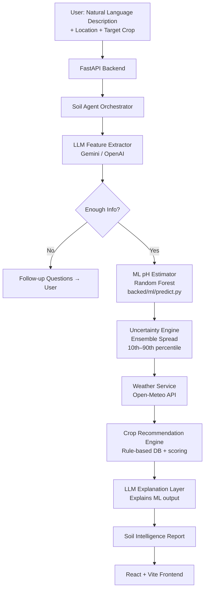

# SoilSense AI 🌱

**An AI-powered soil intelligence agent** — Razorpay AI Buildathon (Open Track)

> Describe your soil in plain language. Get ML pH estimation with honest uncertainty, live weather, and crop recommendations.

---

## ⚠️ Scientific Honesty First

This system **ESTIMATES** soil pH from observable soil characteristics. It is **NOT** a laboratory measurement. Every result is accompanied by:

- A **confidence score** derived from ensemble model spread
- A **pH range** (not a single number)
- A **safety disclaimer** reminding users to confirm with a physical soil test before applying amendments

---

## 1. Problem

Smallholder farmers and home gardeners often lack immediate access to laboratory soil testing. A simple question — "Is my soil acidic or alkaline?" — can determine the success or failure of an entire crop cycle, yet the answer requires lab equipment most users don't have.

SoilSense AI bridges this gap by:
- Understanding natural-language soil descriptions
- Extracting structured soil characteristics using LLM
- Predicting an **estimated** pH range using a trained ML model
- Integrating live weather data
- Recommending suitable crops with honest caveats

---

## 2. Architecture



**Critical architectural separation:**
- The **LLM** handles language understanding and explanation only
- The **ML model** handles numerical pH prediction only
- These are never mixed

---

## 3. AI Agent Workflow

1. **User submits** natural-language soil description
2. **Feature Extractor** (LLM) converts text → structured JSON with controlled enum values
3. **Sufficiency Check**: If ≥3 core features (texture, drainage, colour) are known → proceed. Otherwise → ask targeted follow-up questions
4. **ML Predictor**: Random Forest (200 trees) predicts pH for each tree; 10th–90th percentile = pH range
5. **Confidence**: Derived from tree prediction spread; penalised for unknown inputs
6. **Weather**: Open-Meteo Geocoding + Forecast APIs (no key required)
7. **Recommendations**: Rule-based crop database scored by pH compatibility, texture, drainage, and weather
8. **Explanation**: LLM summarises the ML output in plain English (does NOT generate pH numbers)

---

## 4. ML Model

### Dataset
- **Type**: Synthetic, agronomically-grounded
- **Size**: 2,000 samples
- **References**: Brady & Weil "The Nature and Properties of Soils" (15th ed.), FAO Soil Portal
- **Important**: This is a DEMO dataset. Replace `data/soil_dataset.csv` with real field measurements for production use

### Features
| Feature | Encoding |
|---------|---------|
| Texture | sandy=0, sandy-loam=1, loamy=2, silty=3, clay-loam=4, clay=5 |
| Drainage | good=0, moderate=1, poor=2 |
| Moisture | dry=0, moderate=1, wet=2 |
| Organic matter | low=0, moderate=1, high=2 |
| Compaction | loose=0, moderate=1, compacted=2 |
| Water retention | low=0, moderate=1, high=2 |
| Colour | pale=0, yellow=1, brown=2, dark brown=3, black=4, red=5 |

### Results
| Model | MAE | RMSE | R² |
|-------|-----|------|----|
| Random Forest (winner) | 0.22 | 0.28 | 0.66 |
| Gradient Boosting | 0.23 | 0.28 | 0.66 |

### Uncertainty Method
The ensemble spread across all 200 decision trees provides a natural uncertainty estimate:
- pH range = 10th–90th percentile of tree predictions
- Confidence = `max(0.1, 1 - spread/2.0) - unknown_penalty`
- Low confidence warning issued when confidence < 50%

---

## 5. Weather Integration

- **Provider**: [Open-Meteo](https://open-meteo.com/) — free, no API key required
- **Geocoding**: Open-Meteo Geocoding API (resolves city names to lat/lon)
- **Data retrieved**: temperature, humidity, precipitation, 7-day forecast, precipitation probability
- **Integration**: Weather data actively changes crop recommendations and action plan steps

---

## 6. Failure Recovery

| Failure | Recovery |
|---------|---------|
| Weather API timeout | Analysis continues; recommendations exclude weather context |
| Invalid location | Clear error message; analysis continues without weather |
| LLM API failure | Rule-based fallback explanation generated |
| ML model not found | Automatic training on startup; rule-based fallback if training fails |
| Malformed LLM JSON | All enum fields default to "unknown"; analysis still runs |
| Low confidence | Warning message shown; user directed to physical soil test |
| Missing description | Frontend validation + 422 from backend |
| Network timeout | User-friendly error with specific remediation steps |

---

## 7. Setup Instructions

### Prerequisites
- Python 3.10+
- Node.js 18+
- A Gemini API key (get free at [aistudio.google.com](https://aistudio.google.com)) and/or OpenAI API key

### 1. Clone and configure
```bash
git clone <repo>
cd soilsense-ai
cp .env.example .env
# Edit .env and add your API key(s)
```

### 2. Backend setup
```bash
python3 -m venv .venv
source .venv/bin/activate   # Windows: .venv\Scripts\activate
pip install -r requirements.txt

# Train the ML model (also runs automatically on first server start)
python -m backend.ml.train
```

### 3. Frontend setup
```bash
cd frontend
npm install
```

### 4. Run

**Terminal 1 — Backend:**
```bash
# From project root
source .venv/bin/activate
python backend/main.py
# Server starts at http://localhost:8000
```

**Terminal 2 — Frontend:**
```bash
cd frontend
npm run dev
# App opens at http://localhost:5173
```

---

## 8. Environment Variables

| Variable | Required | Description |
|----------|----------|-------------|
| `GEMINI_API_KEY` | ✅ (or OpenAI) | Google Gemini API key |
| `OPENAI_API_KEY` | ✅ (or Gemini) | OpenAI API key (fallback) |
| `BACKEND_HOST` | No | Default: `0.0.0.0` |
| `BACKEND_PORT` | No | Default: `8000` |
| `CORS_ORIGINS` | No | Default: `http://localhost:5173` |
| `LOG_LEVEL` | No | Default: `INFO` |

---

## 9. API Endpoints

| Method | Path | Description |
|--------|------|-------------|
| GET | `/api/health` | Service health + model status |
| POST | `/api/analyze-soil` | Full soil analysis pipeline |
| POST | `/api/soil/follow-up` | Check if more info is needed |
| POST | `/api/chat` | Multi-turn conversational Q&A |
| GET | `/docs` | Interactive Swagger UI |

### Example Request
```json
POST /api/analyze-soil
{
  "description": "My soil is dark brown, sticky when wet, forms hard clumps when dry. Water drains very slowly. I can see earthworms. I want to grow tomatoes.",
  "location": "Pune, India",
  "target_crop": "Tomato"
}
```

### Example Response (abbreviated)
```json
{
  "soil_profile": {
    "texture": "clay",
    "drainage": "poor",
    "moisture": "wet",
    "organic_matter": "high",
    "soil_color": "dark brown"
  },
  "estimated_ph": {
    "min": 6.1,
    "max": 6.9,
    "midpoint": 6.50,
    "confidence": 0.72
  },
  "weather": { "temperature_celsius": 28.0, "precipitation_probability": 45.0 },
  "recommendations": {
    "suitable_crops": [{"crop_name": "Tomato", "suitability": "suitable", ...}],
    "action_plan": [{"action": "Confirm pH with soil test...", "priority": "high"}]
  },
  "safety_disclaimer": "This is an AI-based estimate..."
}
```

---

## 10. Running Tests

```bash
source .venv/bin/activate
python -m pytest backend/tests/ -v
```

Expected: **18 tests pass**

---

## 11. Limitations

- ML trained on synthetic data — real-world accuracy may differ
- pH estimation from visual/tactile soil characteristics has inherent uncertainty
- Weather recommendations use 7-day forecast, which may not match actual conditions
- Crop database covers ~14 common crops; regional varieties are not included
- No user data is persisted (stateless MVP)

---

## 12. Future Improvements

- [ ] Integrate real soil datasets (USDA NRCS, ISCN, SoilGrids)
- [ ] Upload soil photos for colour analysis via computer vision
- [ ] User accounts and historical soil tracking
- [ ] Soil map overlay (SoilGrids API)
- [ ] Regional crop variety database
- [ ] Offline mode with ONNX model
- [ ] Multi-language support
- [ ] Raspi/IoT integration for physical sensor fusion

---

## Built for Razorpay AI Buildathon — Open Track

This project demonstrates genuine AI judgment:
- LLM for language understanding (not for number generation)
- ML model for numerical prediction
- Honest uncertainty quantification
- Real weather integration
- Graceful failure recovery

The system is designed to be genuinely useful to a real farmer — not a demo chatbot.
