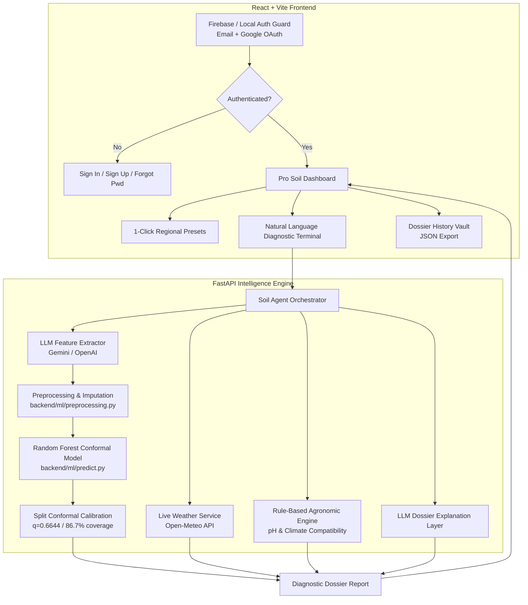

# SoilSense AI 🌱

**Autonomous Soil Intelligence & ML pH Estimation Agent** — Razorpay AI Buildathon 2026 (Open Track)

> Describe your soil in plain language or use 1-click regional archetype profiles. Get scientifically rigorous ML pH estimation with Split Conformal Prediction intervals, live weather risk assessment, crop recommendations, and complete user authentication with historical dossier tracking.

---

## 🏆 Razorpay AI Buildathon 2026 Highlights

- **Ground Truth ML on 6,000+ USDA Samples**: Replaced synthetic heuristics with authoritative physical laboratory soil measurements from USDA NRCS SSURGO.
- **Split Conformal Prediction ($q=0.6644$)**: Statistically rigorous 85% nominal coverage prediction bands rather than arbitrary single-point guesses.
- **Strict Authentication & Google OAuth**: Firebase Auth integration with Email/Password, real-time Google Sign-In, Forgot Password workflow, and high-visibility separated Sign In / Sign Up tabs.
- **Pro Soil Dossier History Vault**: Automatically saves diagnostic runs per user account with 1-click re-inspection and JSON export.
- **1-Click Regional Archetypes**: Pre-configured profiles for Maharashtra Black Regur, Punjab Alluvial Loam, Kerala Red Laterite, and Rajasthan Sandy Arid.
- **Strict Separation of Concerns**: LLMs handle natural language understanding and explanation; Scikit-Learn ML models handle numerical predictions.

---

## ⚠️ Scientific Honesty First

SoilSense AI **ESTIMATES** soil pH from observable soil morphological traits. It is **NOT** a laboratory measurement. Every diagnostic dossier provides:

- A **calibrated uncertainty range** derived from Split Conformal Prediction (e.g. $[4.80 - 6.50]$ pH)
- A **4-factor statistical confidence breakdown** (tree dispersion, input completeness, anomaly penalty, and physical range checks)
- An **explicit agronomic disclaimer** advising physical chemical validation before applying costly soil amendments

---

## 1. Architecture



---

## 2. ML Model & Conformal Prediction Engine

### USDA NRCS SSURGO Measured Dataset
- **Authoritative Source**: [USDA NRCS Soil Data Access (SDA)](https://sdmdataaccess.sc.egov.usda.gov/)
- **Sample Count**: **6,000 real laboratory-measured soil samples** with unique soil component IDs (`cokey`).
- **Target Variable**: Laboratory 1:1 soil-to-water solution pH (`ph1to1h2o_r`, range: 4.0 to 9.5).
- **Zero Group Leakage**: Evaluated with strict `GroupKFold` and `GroupShuffleSplit` on `cokey` so related horizons are never leaked across training, calibration, and test folds.

### Model Benchmarking (5-Fold Group Cross-Validation)

| Model | CV MAE (Mean ± Std) | CV RMSE (Mean ± Std) | CV R² (Mean ± Std) | Status |
| :--- | :--- | :--- | :--- | :--- |
| **Random Forest** | **0.3727 ± 0.0116** | **0.5502 ± 0.0220** | **0.6630 ± 0.0134** | **Selected Champion** |
| Extra Trees | 0.3743 ± 0.0101 | 0.5623 ± 0.0199 | 0.6480 ± 0.0085 | Runner-up |
| Gradient Boosting | 0.3858 ± 0.0123 | 0.5568 ± 0.0153 | 0.6548 ± 0.0048 | Candidate |
| Ridge Regression | 0.4562 ± 0.0161 | 0.6301 ± 0.0190 | 0.5579 ± 0.0125 | Baseline |

### Independent Test Evaluation (900 Unseen Profiles)
- **Test MAE**: `0.3705` pH units
- **Test RMSE**: `0.5514`
- **Test R²**: `0.6485`
- **Empirical Conformal Coverage**: **`86.67%`** (Nominal target: `85.0%`)
- **Average Conformal Interval Width**: `1.33` pH units

---

## 3. Authentication & Security Architecture

SoilSense AI implements a **dual-mode authentication layer**:

1. **High-Visibility Segmented Navigation**:
   - `[ 🔑 Sign In ]` and `[ 👤 Create Account ]` prominent dual-tab interface.
   - Separate dedicated routes (`/login`, `/signup`, `/forgot-password`).
2. **Strict Credential Verification**:
   - Requires registered user confirmation and exact password matching before creating an active session.
   - Password strength meter evaluates length, uppercase, numbers, and special symbols in real time.
3. **Google OAuth via Firebase**:
   - Native integration with Firebase `GoogleAuthProvider` and `signInWithPopup`.
   - Strict security check ensuring live Firebase credentials exist prior to initiating OAuth flows.
4. **Pro Dossier Vault**:
   - Persists completed soil diagnostic dossiers per authenticated user.
   - Enables instant re-inspection and JSON telemetry export.

---

## 4. Setup & Running Locally

### Prerequisites
- **Python 3.10+** (tested on Python 3.14)
- **Node.js 18+** & npm
- A **Gemini API Key** ([Google AI Studio](https://aistudio.google.com/)) or **OpenAI API Key**

### 1. Clone & Configure Environment
```bash
git clone https://github.com/vaish4991/SoilSense-AI.git
cd SoilSense-AI
cp .env.example .env
```

Edit `.env` and fill in your API keys:
```env
GEMINI_API_KEY=your_gemini_api_key_here
# Optional live Firebase credentials (app runs in local auth mode if omitted)
VITE_FIREBASE_API_KEY=
VITE_FIREBASE_AUTH_DOMAIN=
VITE_FIREBASE_PROJECT_ID=
VITE_FIREBASE_STORAGE_BUCKET=
VITE_FIREBASE_MESSAGING_SENDER_ID=
VITE_FIREBASE_APP_ID=
```

### 2. Backend Setup
```bash
python3 -m venv .venv
source .venv/bin/activate    # Windows: .venv\Scripts\activate
pip install -r requirements.txt

# Start FastAPI backend
uvicorn backend.main:app --host 0.0.0.0 --port 8000
```
Backend starts at: [http://localhost:8000](http://localhost:8000) (Interactive Swagger docs: [http://localhost:8000/docs](http://localhost:8000/docs))

### 3. Frontend Setup
```bash
cd frontend
npm install
npm run dev
```
Frontend opens at: [http://localhost:5173](http://localhost:5173)

---

## 5. Running Automated Tests

Run the comprehensive pytest suite covering ML prediction, conformal intervals, feature extraction, group leakage prevention, weather integration, and API endpoints:

```bash
source .venv/bin/activate
pytest backend/tests -v
```

**Expected Result**: All **21 tests pass** (`100%`).

```
backend/tests/test_soilsense.py::test_feature_encoding_known_values PASSED
backend/tests/test_soilsense.py::test_real_model_prediction_and_conformal_interval PASSED
backend/tests/test_soilsense.py::test_group_leakage_prevention PASSED
backend/tests/test_soilsense.py::test_analyze_soil_end_to_end PASSED
...
======================== 21 passed, 1 warning in 4.58s =========================
```

---

## 6. Project Structure

```
SoilSense-AI/
├── backend/
│   ├── agents/
│   │   ├── soil_agent.py             # Pipeline orchestrator
│   │   ├── feature_agent.py          # LLM morphological feature parser
│   │   ├── recommendation_agent.py   # Crop compatibility rules
│   │   └── explanation_agent.py      # LLM dossier explanation layer
│   ├── api/
│   │   ├── routes.py                 # REST endpoints
│   │   └── chat.py                   # Conversational soil assistant
│   ├── ml/
│   │   ├── model/soil_ph_model.joblib # Trained champion Random Forest bundle
│   │   ├── predict.py                # Conformal prediction & uncertainty bounds
│   │   ├── preprocessing.py          # Strict encoder & outlier handler
│   │   └── train.py                  # Group-CV training pipeline
│   ├── schemas/soil_schema.py        # Pydantic telemetry models
│   ├── tests/test_soilsense.py       # 21 unit & integration tests
│   └── main.py                       # FastAPI application entry
├── frontend/
│   ├── src/
│   │   ├── components/
│   │   │   ├── HeroSection.jsx       # 1-Click presets & attribute builder
│   │   │   ├── AnalysisReport.jsx    # Diagnostic dossier UI
│   │   │   ├── Navbar.jsx            # User avatar pill & history trigger
│   │   │   ├── HistoryModal.jsx      # Dossier vault & JSON export
│   │   │   └── ProtectedRoute.jsx    # Authentication route guard
│   │   ├── context/AuthContext.jsx   # Strict credentials & Google OAuth
│   │   ├── pages/
│   │   │   ├── LoginPage.jsx         # Sign in with high-visibility tabs
│   │   │   ├── SignupPage.jsx        # Registration with password strength
│   │   │   └── ForgotPasswordPage.jsx# Password recovery flow
│   │   ├── firebase.js               # Firebase client initialization
│   │   └── App.jsx                   # Application routing & state
│   └── package.json
├── data/
│   └── usda_ssurgo_soil_samples.csv  # 6,000 USDA NRCS laboratory records
├── README.md
└── requirements.txt
```

---

## 7. License & Acknowledgements

- Built for the **Razorpay AI Buildathon 2026 (Open Track)**.
- Soil survey data courtesy of the **USDA Natural Resources Conservation Service (NRCS)** Soil Data Access.
- Hyperlocal weather intelligence powered by **Open-Meteo**.
